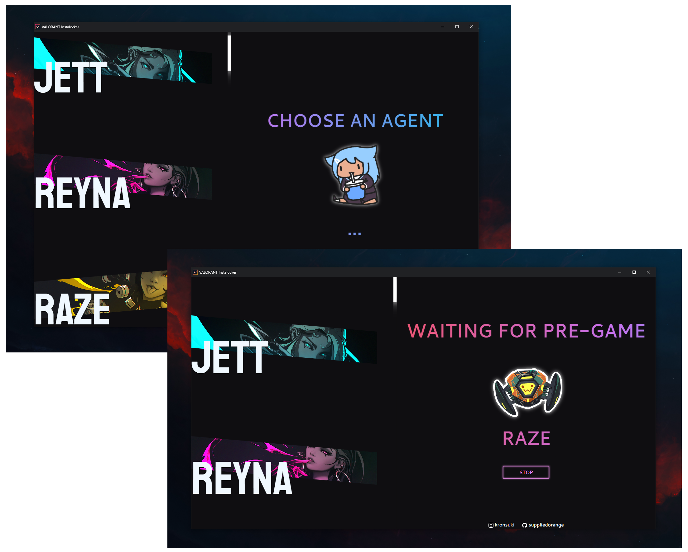

# VALORANT Instalocker
 ✨A VALORANT Instalocker with a clean GUI

 

## 🎡 Features

- Select an agent, hop into a game and it instalocks before you even know it!
- Allows you to stop the application from waiting for pre-game whenever
- Allows you to switch between characters while instalocking
- Stops instalocking and sending API requests as soon as an error is found
- Clean and straightforward UI.
- Fixed 5 second refresh limit to better prevent API abuse (maybe future feature to change it?)
- Agent banners, agent previews and other stuff i put in because memes

 

## 📩 Installation
[Link]: # 'https://github.com/SuppliedOrange/VALORANT-Instalocker/releases/latest'
[Button Icon]: https://img.shields.io/badge/Releases-EF2D5E?style=for-the-badge&logoColor=white&logo=DocuSign
[![Button Icon]][Link]

 

## ❔ How to use

- Start VALORANT
- Select any agent from the left-hand-side list
- Instalocking should begin automatically

- If an error occurs try:
    1) Selecting another agent and selecting the previous one again
    2) Stopping and starting the instalock
    3) Reopening the application
    4) Logging into VALORANT again

 

## ❓ Can I get banned?

Not likely. Unless you go around telling everyone you have an instalocker. Don't boast it or flaunt it and use it reasonably.
 
> [@deadly](https://github.com/deadly): With all programs like this, there is no guarantee that it's safe because using the VALORANT API in this manner is against Riot's Terms of Service. However, this program does not use an autoclicker to select the agent, read the game's memory, or change the game's files; therefore, the anticheat shouldn't be triggered. No suspensions have been reported so far from using this method. All things considered, I would use this only on an alt account if you don't want to risk the 7 day API abuse account suspension on your main, albeit unlikely. 

 

## 🛠 Building 
- Download and open the repository
- Run `pip install -r requirements.txt`
- Run `python -m eel main.py web --onefile --noconsole --icon=./web/favicon.ico --name="VALORANT Instalocker" --paths ./venv/Lib/site-packages`

## Credits

- Heavily inspired by [valorant-agent-yoinker](https://github.com/deadly/valorant-agent-yoinker)
- Other than Gekko, all agent banners were made by [ExCharny](https://www.deviantart.com/excharny)
- Most Agent previews (sprays and official stickers) are from the official [VALORANT giphy page](https://giphy.com/playvalorant)
- Some of the agent previews come from unknown sources, let me know if you find their sources!